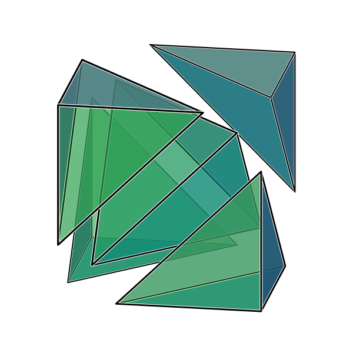

scam
====

Create publication quality 3D graphics using GNU Guile and cairo.
This project has a [very nice website](http://jhidding.github.io/scam "Scam project site") at which a little more is explained about Scam. This archive contains a reduced version of the "Stanford Bunny" from the [Stanford 3D scanning repository](http://graphics.stanford.edu/data/3Dscanrep/).

This repository contains two versions of the code. One in Guile Scheme, the other in C++.

Scheme Scam
===========

To run the Scheme version of Scam you need to have `guile` installed together with the `guile-cairo` bindings. You may run the example programs in `test` using

        guile -L .. umbilic-test.scm

or similar. Let's go through a small example.

Cube tutorial
-------------

Scam is a R6RS library. A program starts with the following imports.

``` {.scheme file=examples/exploding-cube.scm #exploding-cube}
(import (rnrs (6))
        (scam)
        (cairo))
```

Polygons
--------

We need to define a geometry. We have a cube with eight vertices. Scam has different types for points (`a-point`), vectors (`a-vector`) and vertices (`vertex`). A point is a location in space with three coordinates, a vector is the movement from one point to another. A vertex is the abstract combinatorial notion of a 0-dimensional component to a geometry. In the end all of these are represented by three numbers, but it is their meaning that counts.

``` {.scheme #exploding-cube}
(define cube-points
  (list (:. 0 0 0) (:. 1 0 0) (:. 0 1 0) (:. 1 1 0)
        (:. 0 0 1) (:. 1 0 1) (:. 0 1 1) (:. 1 1 1)))
```

From vertices we can construct faces. Lets make five tetrahedra that compose the cube.

``` {.scheme #exploding-cube}
(define tet-faces
  (list '((0 2 1) (0 1 4) (0 2 4) (1 4 2))
        '((3 1 2) (3 2 7) (3 7 1) (1 7 2))
        '((5 7 4) (5 4 1) (5 1 7) (1 4 7))
        '((6 4 7) (6 7 2) (6 2 4) (2 4 7))
        '((2 4 1) (2 7 1) (7 4 1) (7 4 2))))
```

Each piece will be offset slightly like they're flying appart.

``` {.scheme #exploding-cube}
(define tet-offsets
  (list (:> -1 -1 -1)
        (:>  1  1 -1)
        (:>  1 -1  1)
        (:> -1  1  1)
        (:>  0  0  0)))
```

From these numbers we can create a set of polygons. Note, that we have some functional helpers: `$`, which is a short hand for partial application, and `comp` for composing functions.

``` {.scheme #exploding-cube}
(define (offset-vertices offset)
  (map (comp point->vertex ($ a-translate (a-scale 0.2 offset))) cube-points))

(define (offset-polygon faces offset)
  (map (lambda (face)
         (make-polygon
           (map (lambda (vtx) (list-ref (offset-vertices offset) vtx))
                face)))
       faces))

(define faces
  (apply append (map offset-polygon tet-faces tet-offsets)))
```

Materials
---------

Now that we have computed a set of faces we need to render them. But first! The geometry needs a material. Suppose we have done all the computations of how a face ends up on the 2D canvas that we draw on. Scam will have drawn a closed polygon path in Cairo, and will be expecting `set-source`, `fill-preserve` and `stroke` commands. These are all delegated to the material. In Scam a material is a function taking `z`, `normal`, `set-colour`, `set-linewidth`, `fill` and `stroke` arguments. The first two are values representative of the distance to the polygon and the normal vector w.r.t. the line of sight. In a better version of Scam, the material would be function inside a Cairo monad exposing more cairo primitives for rendering (yes, I'm thinking of those pretty dotted math figures you find in old text books).

That being said, it is huge fun tinkering with materials to get that perfect shade of pink. Scam hase some nice colour utility functions to create palettes from HSV spaces, and manipulate saturation levels. The following material is the result of a lot of tweaking.

``` {.scheme #exploding-cube}
(define (material-fn z normal set-colour set-lw fill stroke)
  (let* ((c (colour-hsv-gradient (make-colour 'hsva 0.600 1.0 0.4 1.0)
                                 (make-colour 'hsva 0.333 1.0 0.7 0.3)))
         (r1 (abs (a-dot normal (:> 0 0 1))))
         (r2 (a-dot normal (:> 0 1 0)))
         (black (make-colour 'rgb 0 0 0))
         (white (make-colour 'rgb 1 1 1))
         (sca   (lambda (mean i) (+ mean (* mean i)))))
    (set-colour (colour-desaturise (c r1) (sca 0.3 r2)))
    (fill)
    (set-lw (inexact (/ 0.05 z)))
    (set-colour white) 
    (stroke)
    (set-lw (inexact (/ 0.03 z)))
    (set-colour black) 
    (stroke)
    ))
```

Cameras and projections
-----------------------

The final step is to render our scene to SVG. We need to pick a location and direction for the camera. The `camera-transform` transforms the space of 3D coordinates to a new space of $x, y, z$ coordinates where $z$ is the vector pointing from the screen to you. The `camera-transform` takes four arguments: position and target points are rather obvious. The third argument is less so: I called it `shub`, short for "should be up hub", it is a vector in the original space that should align with the y-axis (hence up) in the final result. The fourth argument is the chosen projection.

| Projection | Description |
| --- | --- |
| `parallel-projection` | z-axis is flattened |
| `weak-perspective-projection` | xy-plane is scaled as a function of z |
| `(map-projection aitoff-hammer)` | area preserving map projection |

``` {.scheme #exploding-cube}
(define camera
  (camera-transform (:. 1.0 3.5 1.5)     ; position
                    (:. 0.5 0.5 0.5)     ; target
                    (:> 0 0 1)
                    parallel-projection))
```

Rendering
---------

Final rendering is done to an SVG surface.

``` {.scheme #exploding-cube}
(let ((s (make-svg-renderer camera 600 600 "exploding-cube.svg")))
  (render-do s (lambda (cr)             ; run custom Cairo commands
                 (cairo-set-line-join cr 'round)))
  (render-scale s 250 250)
  (render-translate s 300/250 300/250)
  (render-scene s (map ($ polygon-add-material -- (make-material-linefill-fn material-fn)) faces))
  (render-finish s))
```

Resulting in the following image:



